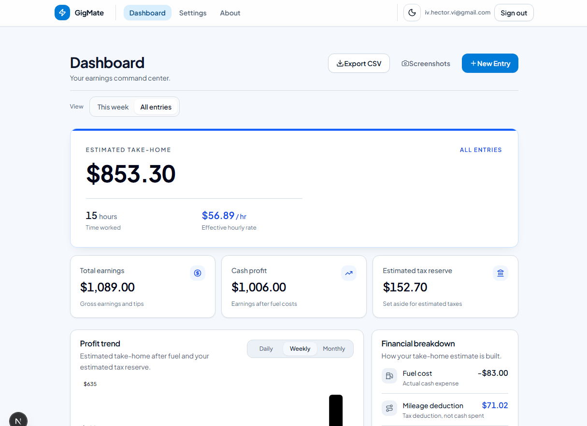
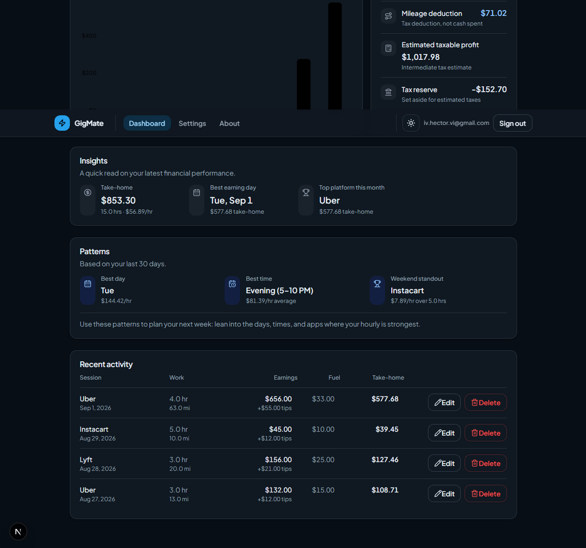
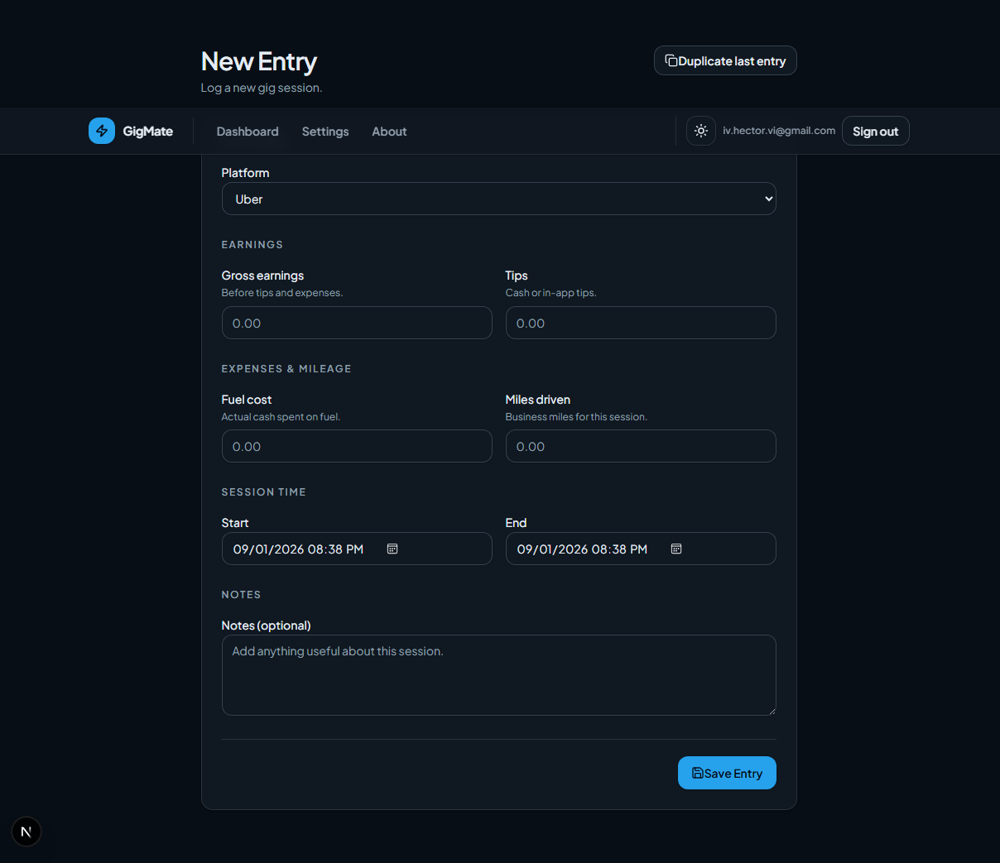

# GigMate

**A financial command center for gig workers** that turns shift-level earnings, tips, mileage, fuel, and time into a clearer estimate of take-home pay.

[](https://nextjs.org/) [](https://www.typescriptlang.org/) [](https://supabase.com/) [](#testing)

**[Live Demo](https://gigmate-six.vercel.app)**



*Financial dashboard with take-home estimates, earnings metrics, trends, and financial breakdown.*

## Overview

Gig workers can see gross payouts in each platform, but gross earnings alone do not answer the practical question: “What did I actually make?” Fuel, tax deductions, tax reserves, mileage, and time worked all affect that answer in different ways.

GigMate records sessions across supported gig platforms and applies one shared financial model to the dashboard, entry history, CSV exports, and weekly email summaries. It separates total earnings, cash profit, mileage deduction, estimated taxable profit, tax reserve, estimated take-home, and effective hourly rate instead of collapsing them into one misleading “net” number.

The result is a responsive full-stack product built around explicit financial semantics, per-user data isolation, validated inputs, and tested reporting boundaries.

## Features

### Earnings Tracking

- Create, review, edit, and delete gig sessions.
- Record platform, local start/end times, base earnings, tips, miles, fuel cost, and notes.
- Track Uber, Lyft, DoorDash, Instacart, Amazon Flex, or another platform.
- Use mobile card layouts or a wider desktop activity table.

### Financial Analytics

- Calculate cash profit, mileage deduction, taxable profit, tax reserve, take-home, and take-home per hour.
- Configure mileage and tax-reserve rates per account.
- Keep fuel as a cash expense and mileage as a tax deduction—two distinct effects.
- Preserve calculations in integer cents, with explicit rounding for derived cent values.

### Dashboard & Insights

- Switch between the current week and all-time entry scopes.
- Compare take-home trends by day, week, or month in a responsive Recharts bar chart.
- Surface best earning day, week-over-week movement, top monthly platform, and longer-term day/time/platform patterns when sufficient data exists.
- Use an accessible, responsive interface with persisted light and dark themes.

### Authentication & Data

- Sign in or create an account with a passwordless email link or Google OAuth through Supabase Auth.
- Store entries and account-specific calculation settings in PostgreSQL.
- Enforce ownership with row-level security policies for entry CRUD and settings access.
- Create default financial settings automatically for each new authenticated user.

### Reporting & Export

- Download an authenticated CSV containing raw entry fields and calculated financial values.
- Receive weekly summaries with earnings, expenses, deductions, estimated take-home, hourly rate, best day, and prior-week comparison.
- Run the weekly report through a Vercel Cron schedule and deliver it with Resend.

## Financial Model

GigMate’s authoritative calculation engine lives in `lib/finance.ts`. For each entry:

```text
Total earnings             = base earnings + tips
Cash profit                = total earnings - fuel cost
Mileage deduction          = round(miles × mileage rate)
Estimated taxable profit   = max(0, total earnings - mileage deduction)
Estimated tax reserve      = max(0, round(estimated taxable profit × reserve rate))
Estimated take-home        = cash profit - estimated tax reserve
Estimated hourly rate      = round(estimated take-home / exact elapsed hours)
```

Money inputs are stored as integer cents, and the tax rate is stored in basis points. Derived mileage deductions, tax reserves, and hourly rates are rounded to integer cents. Entry-level results are then aggregated, so the dashboard, CSV export, and weekly summary use the same semantics.

Most importantly, the mileage deduction is modeled as a tax deduction, not a cash expense: it reduces estimated taxable profit but does not reduce cash profit. Fuel has the inverse role in this model: it reduces cash profit but is not subtracted again when estimating taxable profit.

These figures are planning estimates, not tax advice.

## Engineering Highlights

- **One financial source of truth:** pure calculation functions serve dashboard cards, charts, activity rows, exports, and email reports.
- **Layered validation:** shared Zod schemas validate forms, the finance engine rejects invalid numeric inputs, and PostgreSQL constraints enforce nonnegative values, valid tax-rate bounds, and end-after-start timestamps.
- **Intentional time boundaries:** browser analytics use local calendar boundaries; scheduled reports use completed UTC weeks. Both use half-open ranges (`start <= timestamp < end`) to avoid overlaps at midnight and week boundaries.
- **Defense in depth:** Supabase RLS scopes user data, exports verify bearer tokens and retain the caller’s JWT for RLS, and the service-role key stays in server-only routes.
- **Hardened reporting paths:** the cron route fails closed without `CRON_SECRET` and accepts only an exact bearer credential; auth callbacks restrict redirects to the application origin.
- **Safer spreadsheets:** CSV serialization escapes delimiters and prefixes formula-like string cells to mitigate formula injection.
- **Responsive and accessible UI:** mobile/desktop activity views, responsive charts, semantic section labels, focus states, screen-reader text, status/alert roles, and persisted dark mode.

## Tech Stack

| Area | Technology |
| --- | --- |
| Application | Next.js 16 App Router, React 19, TypeScript 5 |
| UI | Tailwind CSS 4, Radix UI primitives, class-variance-authority, Lucide React |
| Forms & validation | React Hook Form, Zod, Hookform Resolvers |
| Charts | Recharts |
| Dates | native `Date`, `Intl`, date-fns |
| Backend & data | Next.js Route Handlers, Supabase Auth, PostgreSQL, Row Level Security |
| Email & scheduling | Resend, Vercel Cron |
| Testing & quality | Node.js test runner, ESLint 9 |
| Deployment | Vercel application/cron with a Supabase backend |

## Testing

The test command runs TypeScript tests directly with Node’s built-in test runner:

```bash
pnpm test
```

The current suite contains **76 passing tests** across seven test files. It covers:

- financial formulas, cent rounding, aggregation, invalid values, negative outcomes, and duration/hourly-rate behavior;
- local/UTC conversions, Monday-based weeks, half-open ranges, adjacent boundaries, months, and recent-day windows;
- entry and settings validation, including dates, numeric inputs, overnight work, and tax-rate limits;
- weekly aggregation, best-day grouping, fallback settings, email labels, and consistency with the financial engine;
- CSV escaping, formula-injection mitigation, calculated columns, and default settings;
- cron authorization, including missing/wrong secrets and rejection of query-string credentials;
- auth callback redirect handling for internal, external, protocol-relative, script, data, and malformed destinations.

## Architecture

```text
Browser: Next.js/React dashboard
        |
        +--> Supabase Auth (magic link + Google OAuth)
        |
        +--> Supabase PostgreSQL
        |      +--> entries + settings
        |      +--> per-user RLS + database constraints
        |
        +--> shared finance, validation, and date modules
        |
        +--> authenticated Next.js CSV route
        |
Vercel Cron --> secured Next.js weekly-summary route
                      +--> Supabase service-role reads
                      +--> shared finance/report builder
                      +--> Resend email delivery
```

The interactive dashboard reads and writes through the authenticated Supabase client. Server routes handle the operations that need controlled credentials: export generation uses the caller’s access token, while the scheduled summary keeps service-role and email-provider credentials on the server.

## Security & Data Integrity

- RLS policies restrict entry select/insert/update/delete and settings select/update to the owning authenticated user.
- Foreign keys cascade user deletion; indexes support user/date queries; update triggers maintain timestamps.
- The export route verifies the access token, queries through RLS, disables response caching, and does not use the service role.
- Service-role access is isolated to server routes for waitlist administration and scheduled cross-user reporting.
- The cron endpoint requires an exact `Authorization: Bearer <CRON_SECRET>` header and fails closed when the secret is absent.
- Auth redirects accept only same-origin application paths.
- Client schemas and database constraints jointly protect financial and timestamp invariants.
- CSV string cells that could execute as spreadsheet formulas are neutralized before download.

## Running Locally

Prerequisites: Node.js 20+, pnpm, and either a Supabase project or the Supabase CLI/Docker local stack.

1. Clone the repository and enter it.

   ```bash
   git clone https://github.com/BusshiiQT/Gigmate.git
   cd gigmate
   ```

2. Install the locked dependencies.

   ```bash
   pnpm install
   ```

3. Copy the variable names below into `.env.local` and supply values from your Supabase and Resend projects. Do not expose the service-role key or other secrets with a `NEXT_PUBLIC_` prefix.

4. Apply the SQL files in `supabase/migrations/` in timestamp order. With a linked Supabase CLI project, run:

   ```bash
   supabase db push
   ```

   For local Supabase, `supabase start` uses the checked-in `supabase/config.toml` and migrations. Configure the Auth site URL/redirect allow-list for `http://localhost:3000`; enable Google in Supabase if you want to test OAuth.

5. Start the application.

   ```bash
   pnpm dev
   ```

6. Open [http://localhost:3000](http://localhost:3000).

## Environment Variables

```dotenv
# Required for the application and authenticated export
NEXT_PUBLIC_SUPABASE_URL=
NEXT_PUBLIC_SUPABASE_ANON_KEY=

# Required by server-side administration / weekly reports
SUPABASE_SERVICE_ROLE_KEY=

# Required for weekly email delivery (and welcome email delivery, if used)
RESEND_API_KEY=
MAIL_FROM=

# Required for the scheduled weekly-summary endpoint
CRON_SECRET=

# Optional waitlist email branding
BRAND_NAME=

# Optional fallback to MAIL_FROM for weekly reports
WEEKLY_SUMMARY_FROM_EMAIL=
```

`MAIL_FROM` may be a formatted sender such as `GigMate <notifications@example.com>`, but use a verified domain in Resend. Vercel invokes `/api/cron/weekly-summary` every Monday at 13:00 UTC according to `vercel.json`.

## Screenshots



*Insights, earning patterns, and recent activity in dark mode.*



*Structured gig-session entry workflow.*

## What I Learned

Building GigMate reinforced that financial software depends as much on precise definitions as it does on arithmetic. I had to model cash expenses and tax deductions separately, choose explicit rounding rules, and keep those rules consistent across interactive UI, charts, downloaded data, and scheduled email.

It also pushed me to treat trust boundaries and time boundaries as product concerns. RLS, authenticated server routes, constrained redirects, layered validation, and non-overlapping local/UTC date ranges make the application more dependable. Bringing those pieces together in a cohesive responsive interface was an exercise in full-stack product thinking—not just assembling isolated screens.
